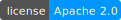

# Travel Guide [](https://github.com/StudentRAF/TravelGuide/blob/master/LICENSE)
Travel Guide is simple web application for exploring destinations around the world.  

## Getting Started

<ins><strong>Requirements:</strong></ins>

- JDK 17 or above
- Maven 3.0.0 or above
- Tomcat 10.0.0 or above
- PostgreSQL 16.0 or above
- JavaScript package manager (npm, yarn, bun...) 

<ins><strong>Database setup:</strong></ins>

1. create PostgreSQL database scheme
2. create tables using `database/create.sql` script
3. seed data using `database/seed.sql` script

<ins><strong>Backend setup:</strong></ins>

Inside folder `backend/src/main/resources` create file `application.local.properties` with structure:
```properties
database.host= #localhost
database.port= #5432
database.scheme= #travel_guide
database.username= #username
database.password= #password
```
Build and package the backend into a web archive (war) and deploy to the tomcat server.
This can be done manually or using an IDE such as IntelliJ IDEA Ultimate (community version does not contain tomcat configuration) or eclipse.

<ins><strong>Frontend setup:</strong></ins>

Inside folder `frontend` create env file `.env.local` with structure:
```properties
TG_API_URL= #http://localhost:8080/TravelGuide/api/v1
```
## Features & Technologies

<ins><strong>Database:</strong></ins>

- PostgreSQL

<ins><strong>Backend:</strong></ins>

- Java
- Java Database Connectivity
- Validation
- Eclipse Jersey
- JSON Web Token
- Pagination

<ins><strong>Frontend:</strong></ins>

- React
- Typescript
- Tailwind (customized)
- Shadcn (customized)
- Axios
- Zod
